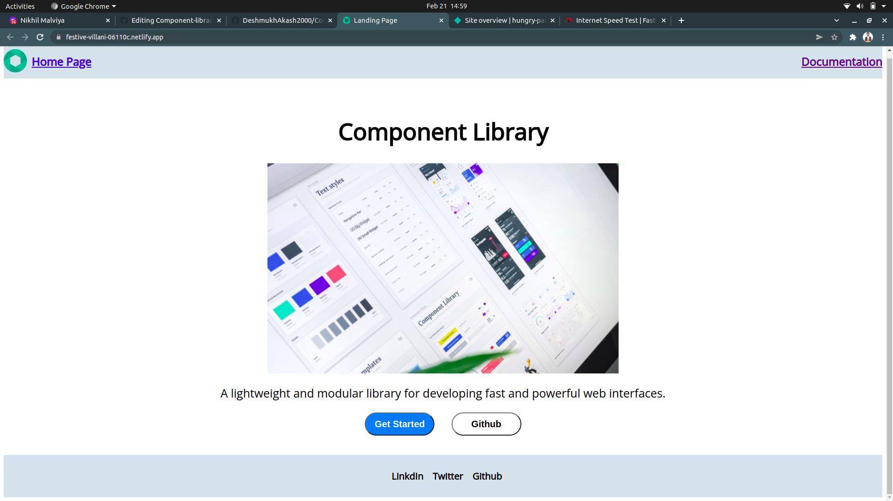

# Component-library
This is a componant library which you will use in building your own web app very easily and morever it lets copy entire layout from this componant to build your own desired website.

## Technologies Used :
- HTML
- CSS

# Home Page Preview :

## Available Componants :
- [Avtar](https://festive-villani-06110c.netlify.app/avtar/avtar.html)
- [Alert](https://festive-villani-06110c.netlify.app/alert/alert.html)
- [Badge](https://festive-villani-06110c.netlify.app/badge/badge.html)
- [Button](https://festive-villani-06110c.netlify.app/btn/btn.html)
- [Card](https://festive-villani-06110c.netlify.app/card/card.html)
- [Input](https://festive-villani-06110c.netlify.app/input/input.html)
- [Navigation](https://festive-villani-06110c.netlify.app/nav/nav.html)
- [Rating](https://festive-villani-06110c.netlify.app/rating/rating.html)
- [Slider](https://festive-villani-06110c.netlify.app/slider/slider.html)
- [Text-Utilities](https://festive-villani-06110c.netlify.app/slider/slider.html)

## Author: [Akash Deshmukh](https://github.com/DeshmukhAkash2000)
 
